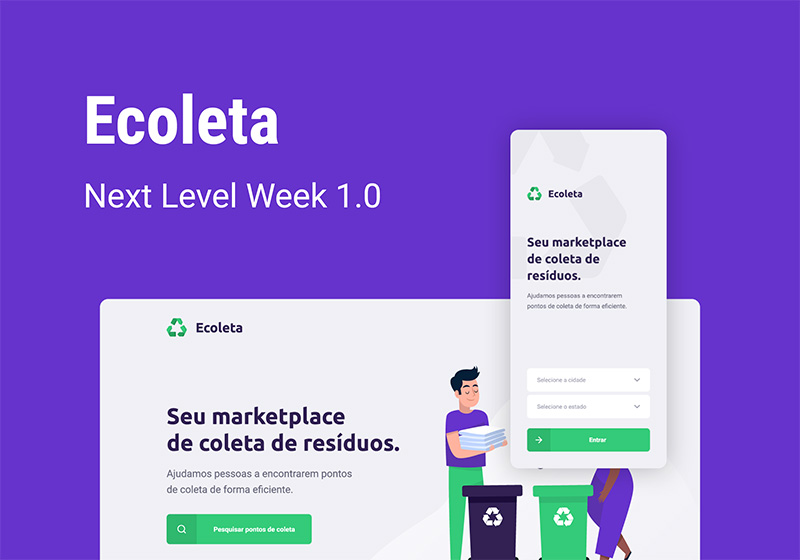

  

<h1 align="center">Next Level Week #01</h1>

### What is

NLW is a practical week with lots of code, challenges and networking.

Objective is to learn new tools, learn about new technologies and discover hacks to boost your career.

There are 5 days of a lot of code and learning, from the backend to the mobile, focusing on the technologies used by the largest startups in the world.

  

### What has been learned

NLW taught about the main fundamentals of API development, distributing data by HTTP requests between two clients, a web, made in React, and a mobile in React native, all using a single language, javascript, but driven by the power of Typescript

### What was used

*The main tools used were:*

- [Node.js](https://nodejs.org/) for the backend
- [React](https://pt-br.reactjs.org/) to the web front end
- [React Native](https://expo.io/) to the mobile front end
- [Expo](https://expo.io/) to assist in the development of mobile
- [Typescript](https://www.typescriptlang.org/) to code the entire project
- [Axios](https://github.com/axios/axios) to HTTP requests
- [Express](https://expressjs.com/) for API server structure
- [Multer](https://github.com/expressjs/multer) to File Upload
- [Knex](http://knexjs.org/) to Database connection